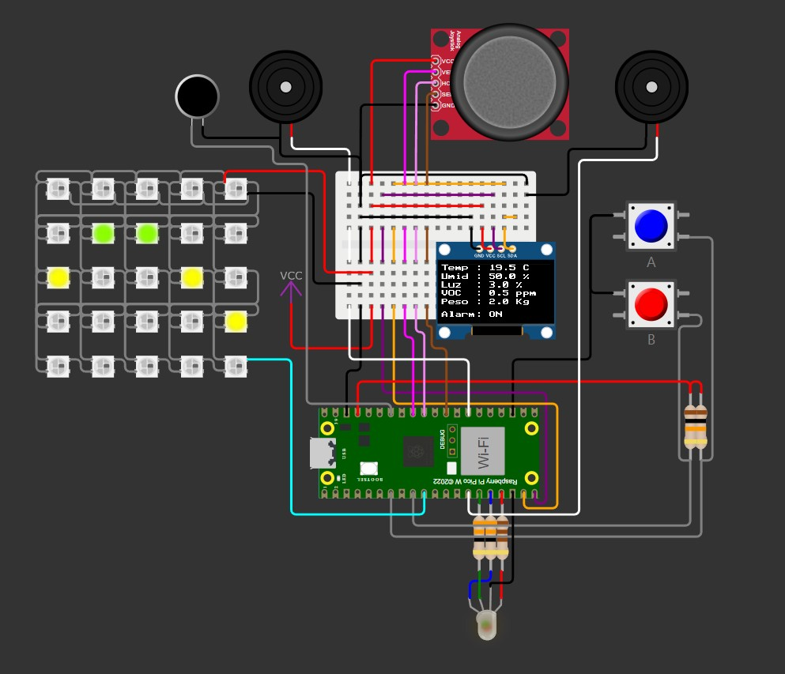
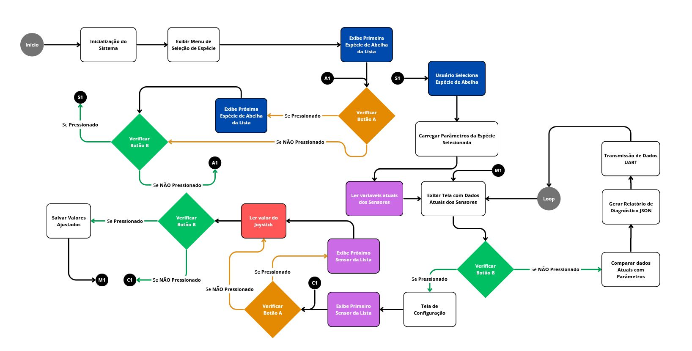
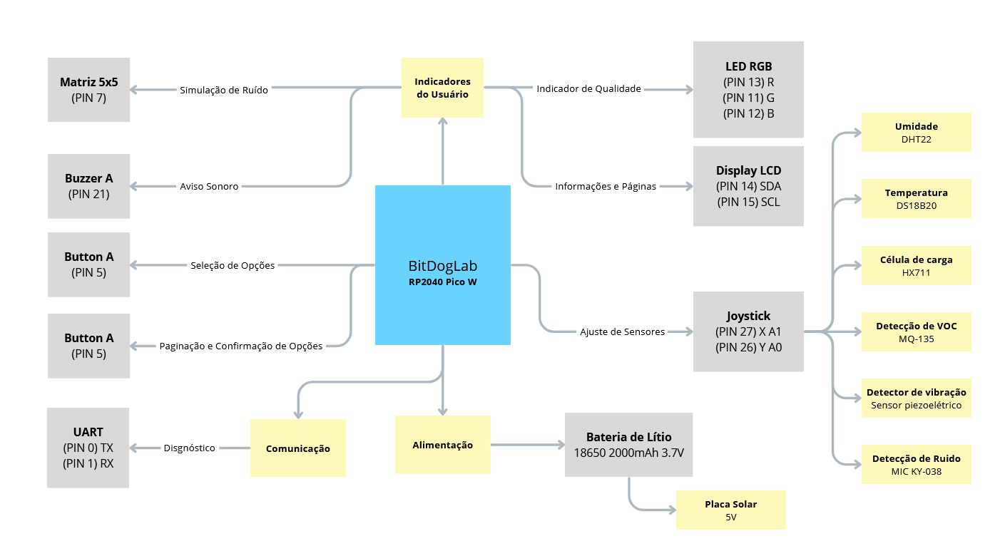

# 🐝 BeeSense: Vigilante Apícola 🐝

## Descrição

BeeSense: Vigilante Apícola é um sistema IoT que simula o monitoramento contínuo e não invasivo das condições internas de colmeias. O projeto foi desenvolvido para identificar, de forma precoce, anomalias que possam comprometer a saúde das abelhas – essenciais para a polinização e a manutenção da biodiversidade. Além de auxiliar os apicultores na tomada de decisões, o sistema serve como ferramenta educacional para fomentar a conscientização sobre a importância das abelhas e estimular novas ideias para a apicultura sustentável.

## Demonstração em Vídeo

Você pode assistir a uma demonstração em vídeo do sistema BeeSense: Vigilante Apícola no link abaixo:

## Funcionalidades

- **Fluxograma de Funcionamento:**
  

- **Monitoramento de Parâmetros:** Leitura contínua dos sensores de temperatura, umidade, peso, ruído, toxicidade e vibração.
- **Interface Interativa:** Utiliza display LCD, botões, joystick, matriz LED e buzzer para exibir informações e alertas.
- **Menu de Seleção de Espécie:** Permite ao usuário escolher a espécie de abelhas, definindo parâmetros ideais (temperatura mínima, máxima, umidade ideal e peso ideal).
- **Tela de Configuração:** Possibilita ajustes dos valores de referência via joystick, os quais são usados para gerar um relatório de diagnóstico.
- **Geração de Relatório:** Compara os dados atuais com os parâmetros definidos e apresenta um diagnóstico da qualidade das colmeias.
- **Comunicação via UART:** Transmite os dados coletados para análise remota, utilizando um protocolo simples e confiável.

- **Imagem do Relatório:**
  

## Requisitos de Hardware

- **Diagrama de Blocos:**
  

- **Plataforma:** BitDogLab
- **Sensores:**
  - **Temperatura:** DS18B20 (ou sensor equivalente)
  - **Umidade:** DHT22
  - **Peso:** Célula de carga com HX711
  - **Detecção de VOC:** MQ-135
  - **Detector de Vibração:** Sensor piezoelétrico
  - **Detector de Som:** Módulo de microfone KY-038
- **Interface:** Display LCD (SSD1306), botões (BUTTON_A e BUTTON_B), joystick, matriz LED, buzzer.
- **Comunicação:** Módulo UART para transmissão de dados.
